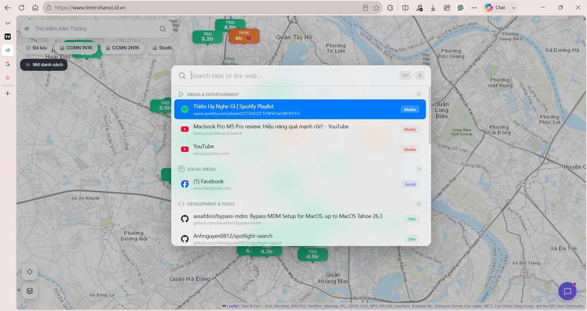

# Spotlight Search - Quick Tab Finder 🔍🚀

A sleek, macOS-style Spotlight Search bar for your browser. Quickly search and switch between your open tabs, or search the web with instant Google suggestions. 

Designed for power users, developers, and anyone who navigates dozens of open tabs.



---

## ✨ Features

- 💻 **macOS Spotlight Aesthetics**: Clean glassmorphism (acrylic blur) with dynamic Light & Dark themes that automatically follow your system settings.
- 📂 **Smart Tab Classification**: Automatically groups and badges your open tabs into sensible categories:
  - 📄 *Documents & Files* (PDF, Word, Notion, Drive, local files, etc.)
  - 🎬 *Media & Entertainment* (YouTube, Spotify, Soundcloud, Netflix, etc.)
  - 💬 *Social Media* (Facebook, X/Twitter, Reddit, etc.)
  - ✉️ *Email & Chat* (Gmail, Slack, Discord, Telegram, etc.)
  - 🛠️ *Development Tools* (GitHub, StackOverflow, Localhost, AWS, etc.)
  - 🛒 *Shopping* (Amazon, eBay, Shopee, etc.)
  - 🌐 *Web* (General sites)
- 🧠 **Instant Google Suggestions**: If no tabs match, it displays Google search suggestions fetched via a robust dual-endpoint fallback system with caching and input aborting.
- ⚡ **Keyboard-First Navigation**: Move through results smoothly using `ArrowUp`/`ArrowDown` and press `Enter` to switch tabs or search.
- 🖱️ **Mouse Drag Gesture**: In addition to keyboard shortcuts, hold **Right-Click** and **drag down** anywhere on the screen (over 80px) to pull down the search bar instantly.
- 🔒 **Performance & Resource Friendly**:
  - In-memory query caching in the background service worker.
  - Automatic `AbortController` usage to terminate outdated request flows while typing, minimizing bandwidth and avoiding rate limits.
  - Browser-wide single-instance management (only one search overlay active across the browser at any time).

---

## ⌨️ Shortcuts & Gestures

| Trigger | Action | Description |
|---|---|---|
| `Ctrl + Q` | **Open / Close** | Toggle the Spotlight search bar overlay on any webpage |
| `Esc` | **Close** | Dismiss the search bar |
| `Right-Click + Drag Down` | **Mouse Trigger** | Pull down the search bar on any page (minimum Y-drag: 80px) |
| `Arrow Up` / `Arrow Down` | **Navigate** | Move highlight focus through search results (ignores static cursor position for comfort) |
| `Enter` | **Select** | Execute selected item (switch tab or search the query on Google) |
| `Click` | **Select** | Switch to tab or open Google search for the clicked suggestion |

---

## 🚀 Installation (Local / Developer Mode)

Since the extension code is fully open-source, you can load it directly into any Chromium-based browser (Edge, Chrome, Brave, Opera, etc.) using one of the following options:

### Option 1: Download from Releases (Recommended & Easiest)
1. Go to the [Releases](https://github.com/Anhnguyen0812/spotlight-search/releases) page of this repository.
2. Download the latest `spotlight-search.zip` file.
3. Extract the ZIP file to a folder on your computer.

### Option 2: Clone the Repository via Git
1. Clone this repository to your local machine:
   ```bash
   git clone https://github.com/Anhnguyen0812/spotlight-search.git
   ```

### Loading the Extension into your Browser
1. Open your browser and navigate to the Extensions page:
   - **Chrome**: `chrome://extensions`
   - **Edge**: `edge://extensions`
2. Turn on **Developer mode** (typically a toggle switch in the sidebar or top-right).
3. Click **Load unpacked** (Tải tiện ích đã giải nén).
4. Select the extracted folder containing the `manifest.json` file.
5. Press `Ctrl + Q` on any standard webpage to start searching!

> [!NOTE]
> Extensions cannot run on browser internal system pages (like `chrome://` or `edge://` settings) or the Chrome Web Store due to browser security restrictions.

---

## 🛡️ Permissions Disclosures

This extension uses minimal permissions to operate and respects your privacy:
- **`tabs`**: Used solely to read the list of active tab titles, URLs, and favicons, enabling tab searching and switching.
- **`host_permissions`** (`google.com`, `suggestqueries.google.com`): Required only to fetch autocomplete suggestions as you type.

**No user data or browsing history is tracked, stored, or sent to any third-party servers.**

---

## 🛠️ Tech Stack & Structure

Built purely using vanilla web technologies for maximum performance and no bloat:
* **HTML & Javascript (ES6)**: UI rendering, tab filtering, caching, and event handling.
* **Vanilla CSS**: Premium glassmorphism effects, flexbox layout, animations, scrollbars, and dark/light styling.
* **Chrome Extension Manifest V3 API**: Service worker background events and messaging.

```text
spotlight_extension/
├── manifest.json       # Extension declarations and permissions
├── background.js       # Service Worker: manages global tabs, caching, API fetch fallbacks
├── content.js          # Injected UI: overlays search window, handles key/mouse inputs
├── spotlight.css       # Stylesheets for glassmorphism, animations and dark/light themes
├── spotlight.html      # Raw HTML layout references (unused at runtime)
├── demo.html           # Independent interactive HTML demo for UI testing
└── icons/              # Extension brand asset graphics (16px, 48px, 128px)
```

---

## 📄 License

This project is licensed under the [MIT License](LICENSE).
